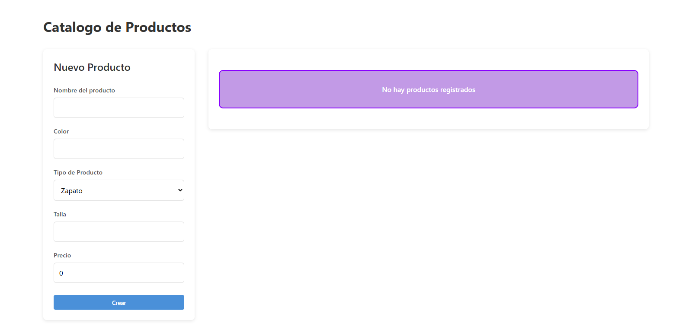

# React + Express CRUD

Guía para ejecutar el proyecto.

## Requisitos previos
En nuestra maquina debemos tener instalado lo siguiente:
- Node.js
- Git
- Npm

## 1. Clonar el repositorio
```bash
git clone <url-del-repo>
cd react-express-crud
```

## 2. Instalar dependencias
El proyecto se divide en dos: backend y frontend, para instalar las dependencias debemos ingresar a cada carpeta y ejecutar el comando `npm install`.

```bash
cd backend
npm install
```

> Lo más recomendable es tener una pestaña de nuestra terminal de para cada carpeta, una para backend y otra para frontend.

## 3. Configurar variables de entorno
### Backend
En la carpeta backend, creamos un archivo `.env` con el siguiente contenido:

```env
PORT=3000
DATABASE_URL="file:./dev.db"
```

Estos representan el puerto donde se ejecutara el backend y el archivo correspondiente a la base de datos, en este caso se trata de SQLite.

### Frontend
De manera similar al backend, en la carpeta frontend debemos crear un archivo `.env` con el siguiente contenido:

```env
VITE_API_URL=http://localhost:3000/api/productos/
```

Esta representa la dirección del backend junto con el endpoint correspondiente, en caso de usar un puerto diferente, debemos cambiarlo en la dirección.

> Nota: deja la `/` final en `VITE_API_URL` para que las operaciones que concatenan el `id` funcionen correctamente.

### 4. Preparar base de datos (Prisma + SQLite)
En nuestra terminal debemos acceder a la carpeta backend del proyecto y ejecutar los siguientes comandos:

```bash
npx prisma migrate deploy
npx prisma generate
```

Estos comandos generaran los archivos y migraciones necesarias para la base de datos.

## 5. Ejecutar el backend

En una terminal, dentro de `backend`:

```bash
npm run dev
```

## 6. Ejecutar el frontend

En otra terminal, dentro de `frontend`:

```bash
npm run dev
```

En la terminal se mostrará la URL del frontend (normalmente `http://localhost:5173`), ya con ambas partes ejecutándose, accedemos a la dirección del frontend y podemos comenzar a utilizar el crud.

